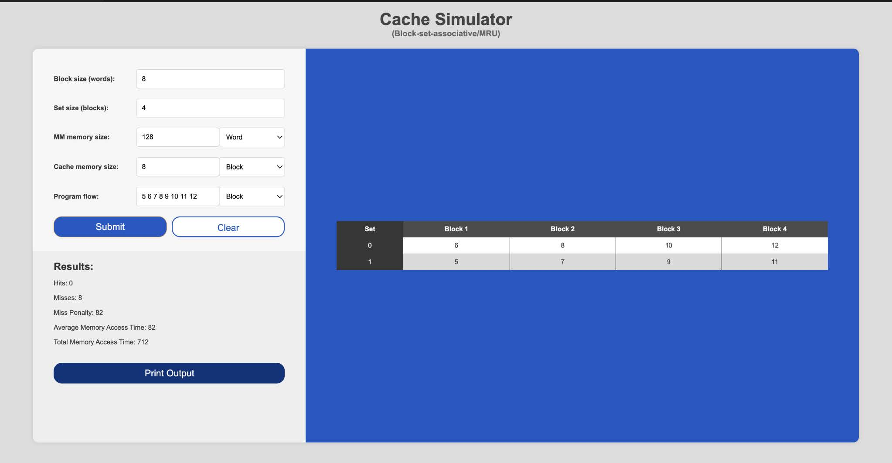
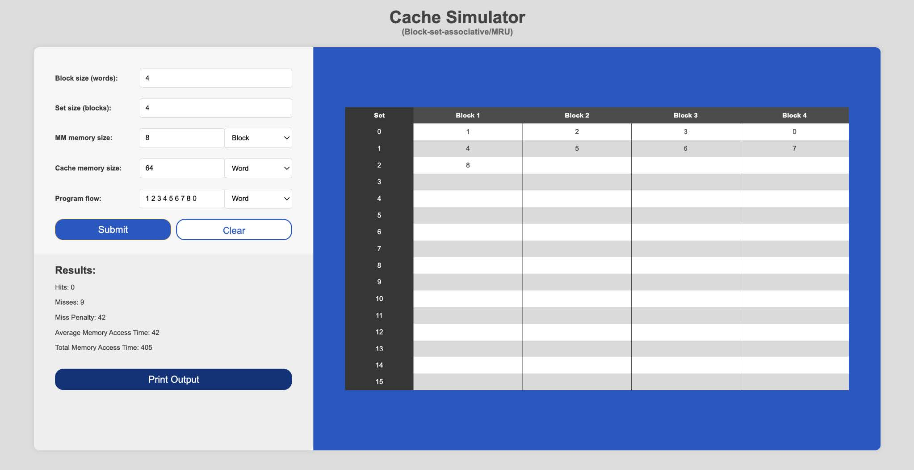
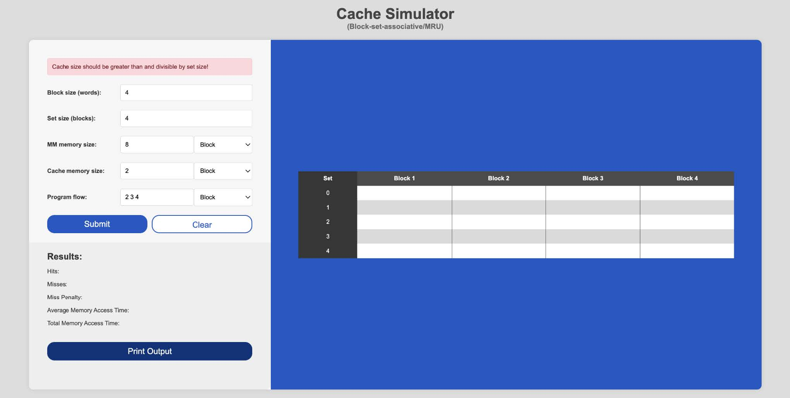

# Cache Simulator (Block-set-associative / MRU) - README
This project is a web-based cache simulator that implements a block-set-associative cache with Most Recently Used (MRU) replacement policy. The simulator is designed to help understand how cache memory works and to visualize the behavior of a cache under different scenarios.

## Features
- User-friendly graphical user interface (GUI)
- Input validation for cache parameters
- Visualization of cache hits and misses
- Calculation of miss penalty, average memory access time, and total memory access time
- Option to export results to a text file
- Clear and reset input fields and results

## Video Demonstration 
A video demonstration of the simulator can be accessed [here](https://drive.google.com/file/d/1jNYiw70G7O7EEFwVLZn6ra77YMlvuCt0/view?usp=sharing) with a De La Salle University account.

## Screenshots
Here are some screenshots of the simulator in action:




## Installation
To run this project locally, follow these steps:

1. Clone the repository:
```bash
git clone https://github.com/czarinadamienne/CSARCH.git
```
2. Navigate to the project directory.
 
3. Open the cachesim.html file in your web browser to start the simulator.

Alternatively, you can visit the deployed web app at [this site](https://cachesimbsamru.onrender.com/).

## Project Structure
- cachesim.html: The main HTML file containing the structure of the simulator.
- cachesim.css: The CSS file for styling the simulator.
- cachesim.js: The JavaScript file containing the logic for the cache simulation.

## Input and Output
### Input
- Block size: The size of each block in words.
- Set size: The number of blocks per set.
- Main memory size: The total size of the main memory, selectable between blocks and words.
- Cache memory size: The total size of the cache memory, selectable between blocks and words.
- Program flow: A sequence of memory addresses to be accessed, selectable between blocks and words.

### Output
- Hits: The number of cache hits.
- Misses: The number of cache misses.
- Miss Penalty: The penalty incurred for a cache miss.
- Average Memory Access Time: The average time to access memory.
- Total Memory Access Time: The total time to access memory during the simulation.
- Cache State: A snapshot of the cache memory showing the contents of each set and block.

### Notes
- Ensure that all input values are powers of 2 and greater than 0.
- The cache size should be greater than and divisible by the set size.
- Program flow values should be less than or equal to the main memory size.    


<br>


*This project was developed by Ang, Esteban, Herrera, and Lim as part of the CSARCH2 S12 Simulation Project.*
